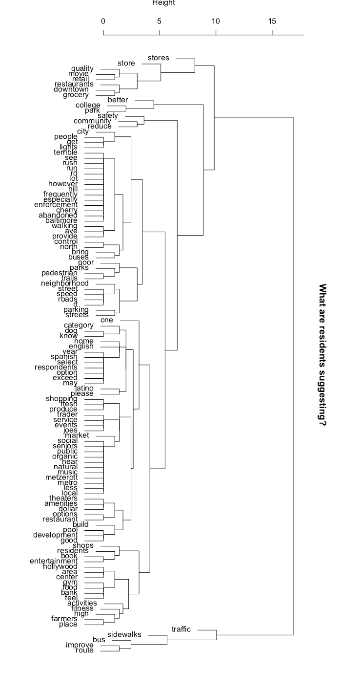

# Text-Analysis-with-R
This project was for a local non-profit.  The auto_summarize program downloads a large .pdf document (College Park 2017 Community Survey Report of Results), scrapes the text, and generates a summary for each section of the document.  Summary.rmd creates a word document with the results of this program.

Next, visualize_suggestions uses a heirarchical cluster analysis to quickly summarize the resident's suggestions.   These suggestions are visualized with several different tree diagrams.  

